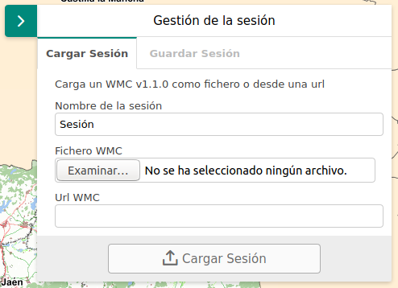

# M.plugin.Wmc

Plugin de Mapea desarrollado por el Instituto de Estadística y Cartografía para poder guardar la sesión de trabajo mediante un fichero de contexto de mapa (WMC), permitiendo poder recuperar o compartir dicha sesión en cualquier momento.



## Dependencias

- wmc.ol.min.js
- wmc.ol.min.css


```html
 <link href="../../plugins/wmc/wmc.ol.min.css" rel="stylesheet" />
 <script type="text/javascript" src="../../plugins/wmc/wmc.ol.min.js"></script>
```

## Ejemplos de uso

### Ejemplo 1
```javascript
   const map = M.map({
   });

   let sp = new M.plugin.Wmc();
   map.addPlugin(sp);
```
